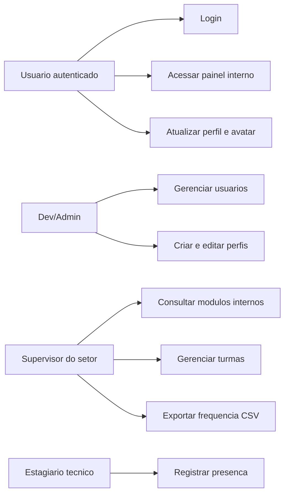
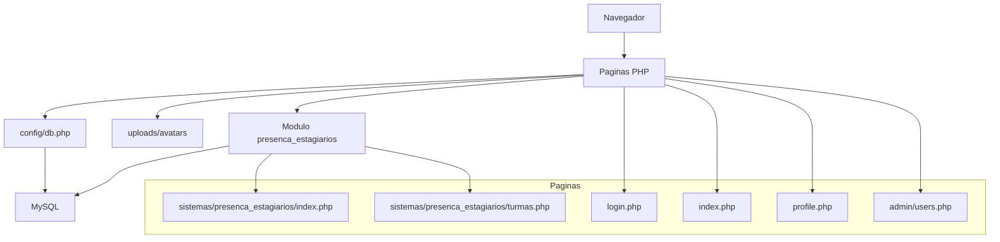
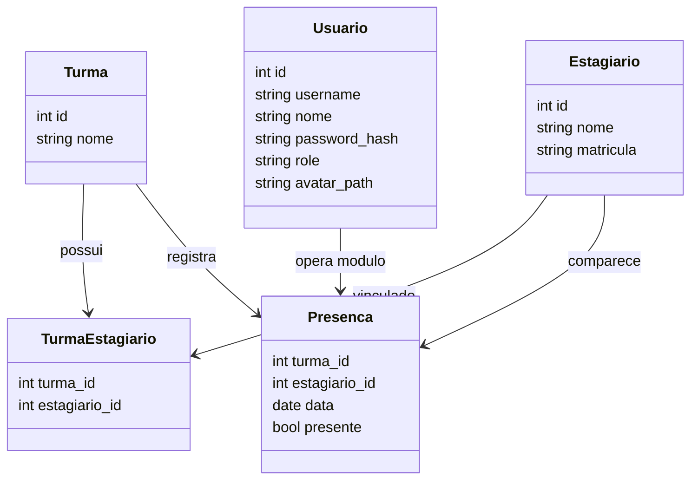
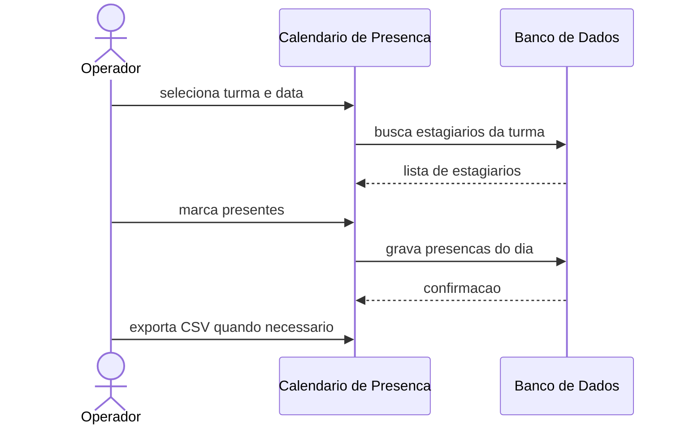

# UML - Sistema Interno CTIC

## Casos de uso

```mermaid
flowchart LR
    Usuario["Usuario autenticado"]
    Dev["Dev/Admin"]
    Supervisor["Supervisor do setor"]
    Estagiario["Estagiario tecnico"]

    Usuario --> UC1["Login"]
    Usuario --> UC2["Acessar painel interno"]
    Usuario --> UC3["Atualizar perfil e avatar"]

    Dev --> UC4["Gerenciar usuarios"]
    Dev --> UC5["Criar e editar perfis"]

    Supervisor --> UC6["Consultar modulos internos"]
    Estagiario --> UC7["Registrar presenca"]
    Supervisor --> UC8["Gerenciar turmas"]
    Supervisor --> UC9["Exportar frequencia CSV"]
```

## Arquitetura

```mermaid
flowchart TB
    Browser["Navegador"]
    Pages["Paginas PHP"]
    Config["config/db.php"]
    Database["MySQL"]
    Uploads["uploads/avatars"]
    Presence["Modulo presenca_estagiarios"]

    Browser --> Pages
    Pages --> Config
    Config --> Database
    Pages --> Uploads
    Pages --> Presence
    Presence --> Database

    subgraph Paginas
        Login["login.php"]
        Home["index.php"]
        Profile["profile.php"]
        AdminUsers["admin/users.php"]
        Presenca["sistemas/presenca_estagiarios/index.php"]
        Turmas["sistemas/presenca_estagiarios/turmas.php"]
    end

    Pages --> Login
    Pages --> Home
    Pages --> Profile
    Pages --> AdminUsers
    Presence --> Presenca
    Presence --> Turmas
```

## Entidades principais

```mermaid
classDiagram
    class Usuario {
        int id
        string username
        string nome
        string password_hash
        string role
        string avatar_path
    }

    class Turma {
        int id
        string nome
    }

    class Estagiario {
        int id
        string nome
        string matricula
    }

    class TurmaEstagiario {
        int turma_id
        int estagiario_id
    }

    class Presenca {
        int turma_id
        int estagiario_id
        date data
        bool presente
    }

    Turma --> TurmaEstagiario : possui
    Estagiario --> TurmaEstagiario : vinculado
    Turma --> Presenca : registra
    Estagiario --> Presenca : comparece
    Usuario --> Presenca : opera modulo
```

## Fluxo de presenca

```mermaid
sequenceDiagram
    actor Operador
    participant Tela as Calendario de Presenca
    participant DB as Banco de Dados

    Operador->>Tela: seleciona turma e data
    Tela->>DB: busca estagiarios da turma
    DB-->>Tela: lista de estagiarios
    Operador->>Tela: marca presentes
    Tela->>DB: grava presencas do dia
    DB-->>Tela: confirmacao
    Operador->>Tela: exporta CSV quando necessario
```
