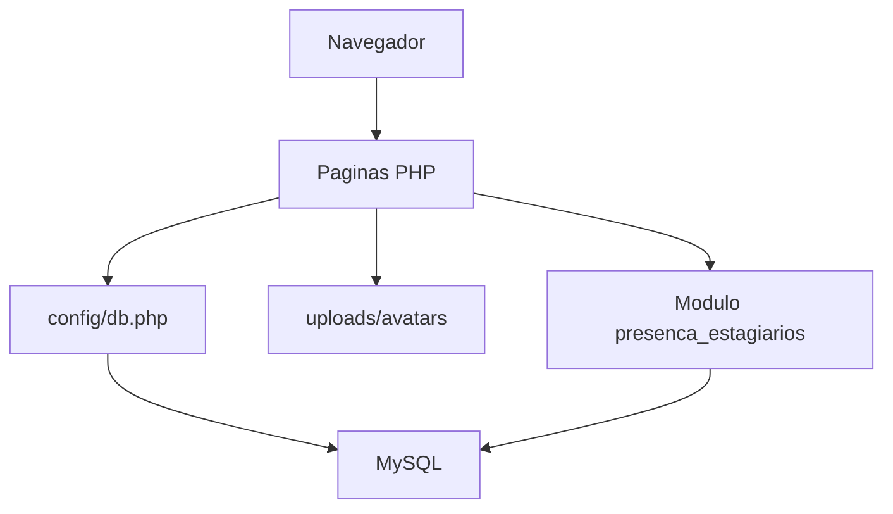

# Arquitetura

```mermaid
flowchart TB
    Browser["Navegador"]
    Pages["Paginas PHP"]
    Config["config/db.php"]
    Database["MySQL"]
    Uploads["uploads/avatars"]
    Presence["Modulo presenca_estagiarios"]

    Browser --> Pages
    Pages --> Config
    Config --> Database
    Pages --> Uploads
    Pages --> Presence
    Presence --> Database
```
