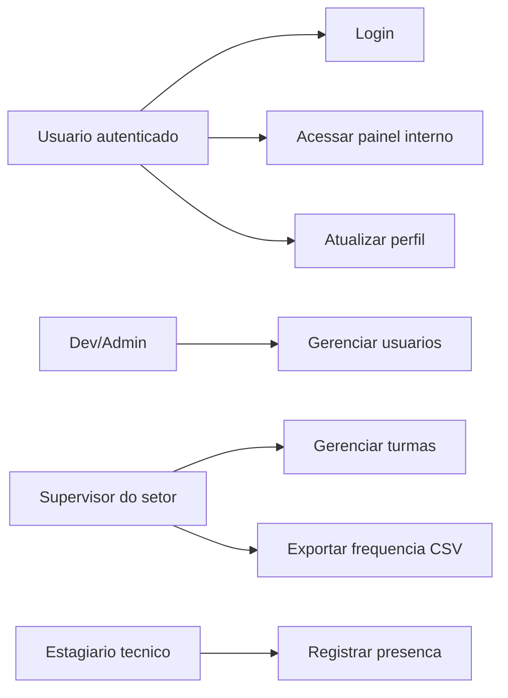

# Casos de uso

```mermaid
flowchart LR
    Usuario["Usuario autenticado"]
    Dev["Dev/Admin"]
    Supervisor["Supervisor do setor"]
    Estagiario["Estagiario tecnico"]

    Usuario --> UC1["Login"]
    Usuario --> UC2["Acessar painel interno"]
    Usuario --> UC3["Atualizar perfil"]
    Dev --> UC4["Gerenciar usuarios"]
    Supervisor --> UC5["Gerenciar turmas"]
    Estagiario --> UC6["Registrar presenca"]
    Supervisor --> UC7["Exportar frequencia CSV"]
```
