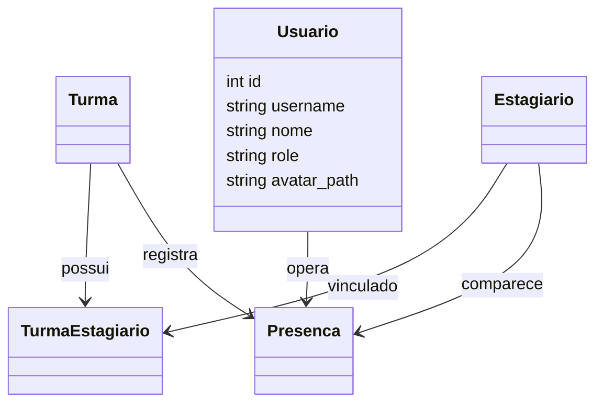

# Entidades principais

```mermaid
classDiagram
    class Usuario {
        int id
        string username
        string nome
        string role
        string avatar_path
    }

    class Turma
    class Estagiario
    class TurmaEstagiario
    class Presenca

    Turma --> TurmaEstagiario : possui
    Estagiario --> TurmaEstagiario : vinculado
    Turma --> Presenca : registra
    Estagiario --> Presenca : comparece
    Usuario --> Presenca : opera
```
