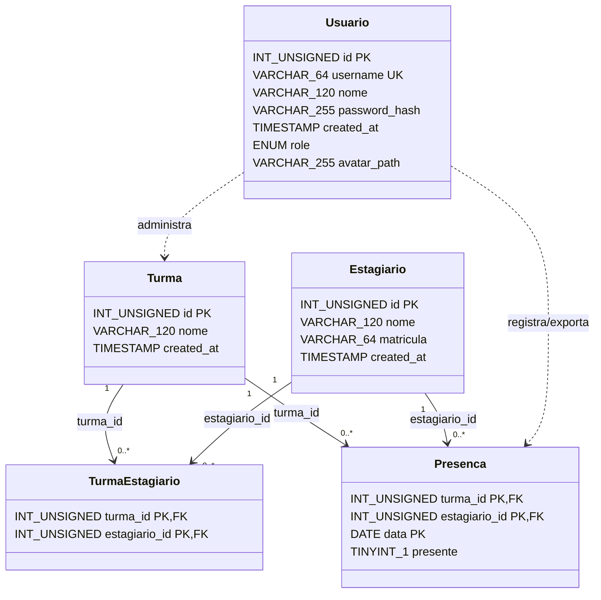

# Modelo de dados

```mermaid
classDiagram
    class Usuario {
        INT_UNSIGNED id PK
        VARCHAR_64 username UK
        VARCHAR_120 nome
        VARCHAR_255 password_hash
        TIMESTAMP created_at
        ENUM role
        VARCHAR_255 avatar_path
    }

    class Turma {
        INT_UNSIGNED id PK
        VARCHAR_120 nome
        TIMESTAMP created_at
    }

    class Estagiario {
        INT_UNSIGNED id PK
        VARCHAR_120 nome
        VARCHAR_64 matricula
        TIMESTAMP created_at
    }

    class TurmaEstagiario {
        INT_UNSIGNED turma_id PK,FK
        INT_UNSIGNED estagiario_id PK,FK
    }

    class Presenca {
        INT_UNSIGNED turma_id PK,FK
        INT_UNSIGNED estagiario_id PK,FK
        DATE data PK
        TINYINT_1 presente
    }

    Turma "1" --> "0..*" TurmaEstagiario : turma_id
    Estagiario "1" --> "0..*" TurmaEstagiario : estagiario_id
    Turma "1" --> "0..*" Presenca : turma_id
    Estagiario "1" --> "0..*" Presenca : estagiario_id
    Usuario ..> Turma : administra
    Usuario ..> Presenca : registra/exporta
```
