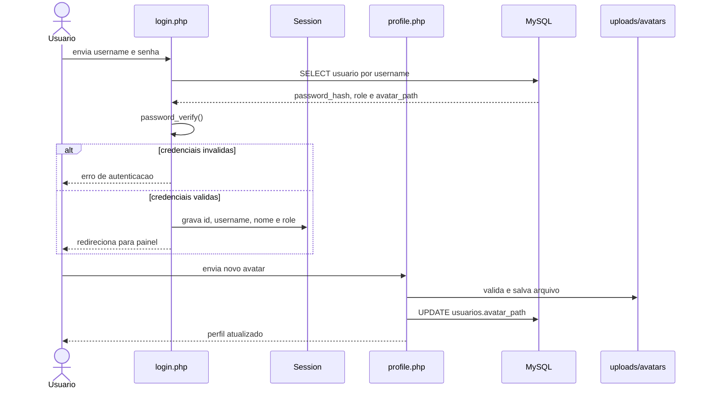

# Fluxo de login e perfil

```mermaid
sequenceDiagram
    actor Usuario
    participant Login as login.php
    participant Sessao as Session
    participant Perfil as profile.php
    participant Banco as MySQL
    participant Uploads as uploads/avatars

    Usuario->>Login: envia username e senha
    Login->>Banco: SELECT usuario por username
    Banco-->>Login: password_hash, role e avatar_path
    Login->>Login: password_verify()
    alt credenciais invalidas
        Login-->>Usuario: erro de autenticacao
    else credenciais validas
        Login->>Sessao: grava id, username, nome e role
        Login-->>Usuario: redireciona para painel
    end

    Usuario->>Perfil: envia novo avatar
    Perfil->>Uploads: valida e salva arquivo
    Perfil->>Banco: UPDATE usuarios.avatar_path
    Perfil-->>Usuario: perfil atualizado
```
