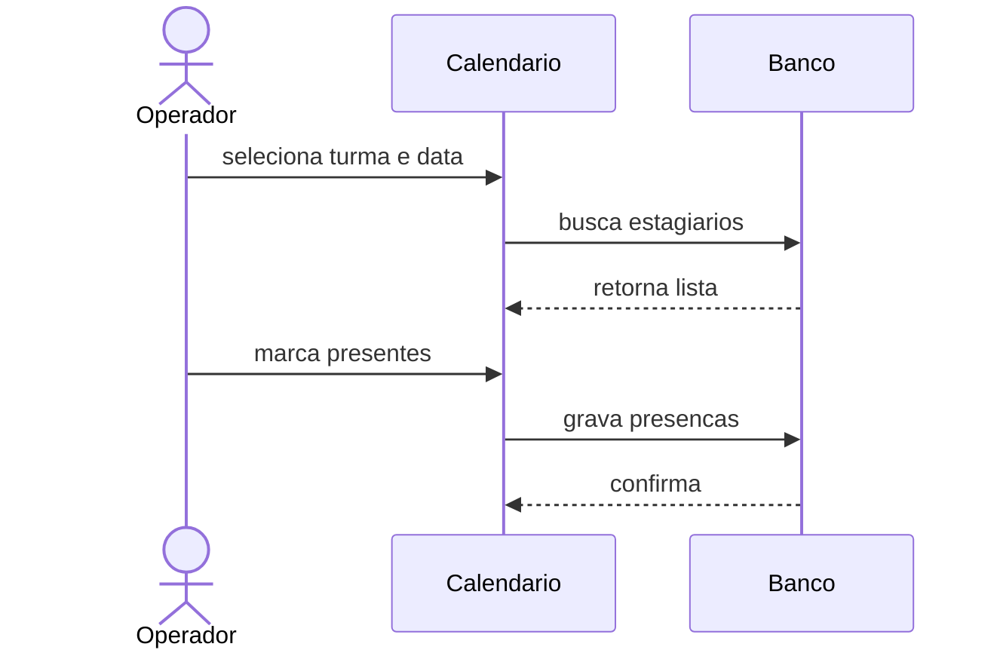

# Fluxo de presenca

```mermaid
sequenceDiagram
    actor Operador
    participant Tela as Calendario
    participant DB as Banco

    Operador->>Tela: seleciona turma e data
    Tela->>DB: busca estagiarios
    DB-->>Tela: retorna lista
    Operador->>Tela: marca presentes
    Tela->>DB: grava presencas
    DB-->>Tela: confirma
```
