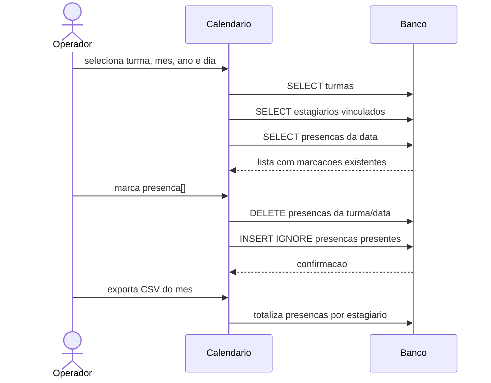

# Fluxo de presenca

```mermaid
sequenceDiagram
    actor Operador
    participant Calendario
    participant Banco

    Operador->>Calendario: seleciona turma, mes, ano e dia
    Calendario->>Banco: SELECT turmas
    Calendario->>Banco: SELECT estagiarios vinculados
    Calendario->>Banco: SELECT presencas da data
    Banco-->>Calendario: lista com marcacoes existentes
    Operador->>Calendario: marca presenca[]
    Calendario->>Banco: DELETE presencas da turma/data
    Calendario->>Banco: INSERT IGNORE presencas presentes
    Banco-->>Calendario: confirmacao
    Operador->>Calendario: exporta CSV do mes
    Calendario->>Banco: totaliza presencas por estagiario
```
